# Gamebuino Classic → SDL

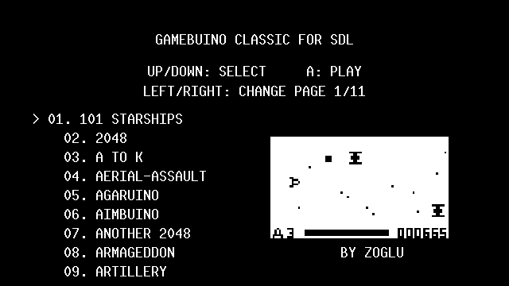

A native SDL3 port bringing **99 games** from the
[Gamebuino Classic](https://github.com/Gamebuino/Gamebuino-Classic) library
(an Arduino-based handheld with an 84x48 Nokia 5110/PCD8544 monochrome
display and 7 real digital buttons) behind one shared game-select menu,
running as a plain desktop executable - no emulator required.

Two more ports also live in this same repo, alongside the primary SDL3
port in `src/sdl3/`, all three sharing one `src/gameworld/` codebase (all
99 games, the menu, the shims):
- **SDL2** (`src/sdl2/`) - built by porting `src/sdl3/`'s own platform
  files API-call-by-API-call, then verified functionally identical (every
  behavioral constant, every input mapping table, every one of the 99
  games).
- **Playdate** (`src/playdate/`) - a genuinely different kind of port
  (fixed 400x240 1-bit hardware, its own C SDK, no CLI/window/desktop
  concept at all), so a from-scratch platform layer instead - a brand-new
  Playdate-native menu (alphabetized, numbered, paginated, with a live
  gameplay thumbnail + author caption for the selected game), manual
  `GAME_SCALE`-based rendering (84x48 native display content scaled 4x,
  336x192, to fit the real panel), real per-game frame-rate sync
  (`pd->display->setRefreshRate()` tracks whatever rate the running game
  actually requests, leveraging the real hardware's own native 0-50fps
  refresh-rate control instead of a fixed-tick accumulator), a real,
  native `LCDPattern`-based checkerboard dither for `GB_GRAY` content
  (`kColorGrey`, a genuine device-pixel-level dither via the Playdate SDK's
  own pattern-fill mechanism, not an approximation), and Gamebuino's own
  Button C - which has no physical Playdate equivalent - routed through a
  real system-menu item instead of a face button. See `CLAUDE.md`'s own
  "The Playdate port" section for the full design writeup.

See `CLAUDE.md`'s "Directory layout / multi-port structure" section for
the full writeup on how this multi-port layout works, and for what a
future fourth port would need to add.

The game logic itself is already-ported, already-bug-fixed C, carried over
from the sibling
[gamebuino_classic_vircon32](https://github.com/joyrider3774/gamebuino_classic_vircon32)
project by converting only the small amount of nonstandard Vircon32
C-dialect syntax it depended on back into standard C (array declaration
order, `int[]`-as-string → `char*`, bare `struct Tag` → `typedef struct`)
- the actual game code, and the whole bug-fix history behind it, is
unchanged. Every per-game bug already found and fixed there (the
byte-truncation/shift-wraparound/signed-sentinel/logical-shift family of
dialect bugs, plus dozens of genuine game-logic bugs found via real play)
applies here too, since it's the same C. Real upstream bugs (gameplay
quirks that look like mistakes) are preserved by default rather than
silently fixed, matching that project's own established policy - see its
own [BUGS.md](https://github.com/joyrider3774/gamebuino_classic_vircon32/blob/main/BUGS.md)
for the full list of what's deliberately preserved vs. what was fixed and
why.

The shared `gameworld/gamebuinoShim.c` sound engine is a real port of the
actual tracker/pattern/track engine (notes, patterns, tracks, and
instrument envelopes/slide/arpeggio/tremolo commands), not just one-shot
tones - with one real, documented gap carried over from the sibling
project unchanged: **there is no noise instrument.** Real hardware drives
its speaker from a genuine pseudorandom noise generator for any
instrument step flagged as noise (e.g. `playTick()`); this port has no
noise waveform at all, so a noise-flagged step plays as a plain tone at
the same pitch/duration instead.

The platform layer itself - window/input/audio/rendering, the menu, the
CLI, and EEPROM persistence - is new, built directly against SDL3, reusing
infrastructure and technique from the same author's `Tinyjoypad_SDL`
project where it fit: the `CInput` keyboard/gamepad abstraction (copied
verbatim, fully generic), the audio oscillator shape, the menu's own real
Vircon32 BIOS-font rendering (`biosFont.h`, copied byte-for-byte
verbatim), and the general multi-port directory/CMake structure.

This port was built with the help of Claude AI (Anthropic) - the platform
layer, the dialect conversion, every game ported across several batches of
background agents, every bug found during the port, and the Playdate
port's own design work were all done through an AI-assisted development
workflow.

## Building

Requires CMake and a C compiler (developed against MinGW-w64/GCC on
Windows; nothing in the source is Windows-specific beyond the `-mwindows`
linker flag, which only suppresses the console window and is skipped on
non-Windows).

This repo has no top-level `CMakeLists.txt` - each port under `src/`
(`src/sdl3/` and `src/sdl2/`) is its own standalone CMake project, built
from inside its own directory:

```sh
cd src/sdl3          # or: cd src/sdl2
cmake -B build -G Ninja -DUSE_VENDORED_SDL=1
cmake --build build
```

- `USE_VENDORED_SDL=1` builds SDL from the matching vendored checkout at
  the repo root (`SDL3/` for `src/sdl3/`, `SDL2/` for `src/sdl2/`) as a
  static library and statically links everything into one self-contained
  executable (no SDL DLL needed alongside it).
- Omit `-DUSE_VENDORED_SDL=1` (or set it to `0`) to link against a
  system-installed SDL instead (`find_package(SDL3 CONFIG)` /
  `find_package(SDL2 CONFIG)` respectively).
- The menu's thumbnail images are compiled directly into the executable
  (`assets/thumbnails/thumbnailData.h`, generated from `assets/thumbnails/
  thumb_NN.bmp` by `tools/gen_thumbnails.py` - re-run it after changing
  any thumbnail) - there's no `assets/` folder to ship or find alongside
  the built exe. The single resulting binary is the complete, runnable,
  relocatable artifact - copy just the `.exe` to distribute it.
- The resulting binary ends up at `src/sdl3/build/GamebuinoClassicSDL3`
  (or `src/sdl2/build/GamebuinoClassicSDL2`, or `.exe` on Windows either
  way). See `CLAUDE.md`'s "Directory layout / multi-port structure"
  section for why the build entry point is per-port rather than a single
  repo-root command.
- The two ports are functionally identical (same shared `src/gameworld/`,
  same CLI, same keybinds) - pick whichever matches what's actually
  available to link against on your system/platform. SDL3 is the primary,
  most-exercised port.

See `CLAUDE.md`'s own "The Playdate port" section for how to build
`src/playdate/` (Simulator and device targets, requires the official
Playdate SDK).

## Running

Identical CLI/behavior on both SDL ports - examples below use the SDL3
binary, substitute `GamebuinoClassicSDL2` (from `src/sdl2/build/`) for the
SDL2 one.

```sh
./GamebuinoClassicSDL3                    # opens the menu
./GamebuinoClassicSDL3 -g "FLAPPY BIRDO"  # launches a game directly by title
./GamebuinoClassicSDL3 -list              # prints every game's title, then exits
./GamebuinoClassicSDL3 -help              # full command-line reference
```

See `-help` for the complete flag list (window size/fullscreen, `-ns` to
skip audio, `-fps` for a live FPS overlay, `-nd` to uncap the framerate,
`-s` to force software rendering instead of the default GPU-accelerated
one, `-ms` to batch-capture a gameplay screenshot of every game, `-gbu` to
write a `.gbu` stub file per game for external frontends, and a `.gbu`
file itself as a positional argument to launch straight into that game).

## Controls

| Action | Keyboard | Gamepad |
|---|---|---|
| Move / navigate menu | Arrow keys | D-pad or left stick |
| Gamebuino Button A / confirm | X | South button (A on Xbox) |
| Gamebuino Button B | C | East button (B on Xbox) |
| Gamebuino Button C | D | West button (X on Xbox) |
| Start / pause / quit-confirmation dialog | Escape or Enter | Start or Back |
| Cycle pixel-grid / glow / CRT scanline effect | G (also L, W, or Z) | Left shoulder (L1) |
| Toggle real-solid-gray-color mode | R (also V) | Right shoulder (R1) |
| Volume down / up | - | Left/Right trigger (L2/R2) |
| Mute / unmute sound | S | North button (Y on Xbox) |

The quit-confirmation dialog (Start, mid-game) freezes the current game
and asks YES/NO before returning to the menu - unless the game was
launched directly (`-g <NAME>` or a `.gbu` file), in which case there's no
menu to return to, so Start quits the app immediately instead, with no
dialog. `GB_GRAY` content (used by several games for a dithered "third
shade" on this strictly 2-color display) renders as a real, flickering
checkerboard dither by default - matching real Gamebuino Classic hardware
exactly - or, with the real-solid-gray-color toggle on (the default here),
as a genuine flat, solid gray instead; only visible in games that actually
draw `GB_GRAY` content.

The pixel-grid/glow/CRT cycle is a single button stepping through all 8
real combinations of the three effects (a genuine 3-bit counter - off,
each effect alone, and every pairing/triple together), only visible during
actual gameplay, not on the menu screen. Fullscreen/volume/mute work
everywhere (menu and in-game) and are logged to the console on every
change, since there's no on-screen indicator for them; `-f`/`-ns` on the
command line still cover fullscreen/no-sound at launch time.

## Games

Click a thumbnail for the full-size screenshot. In the menu, a handful of
titles are shown in **red text** instead of white - a plain visual "known
unfinished" warning (e.g. missing scoring/win-lose conditions, built from
a genuinely incomplete upstream source, or a known bug like a ball that
can get stuck). They're still fully selectable and playable like any
other game, just flagged.

The table also includes **Sound Test**, which uses the same red-text
flagging but for a different reason: it's not a ported game at all, just
an in-cartridge diagnostic tool for exercising the sound shim's own
primitives directly (`playOK()`/`playCancel()`/`playTick()`, a raw pitch
sweep, and a few instrument/volume/slide extras).

| Game | Author | License | Save | Source | Screenshot |
|---|---|---|---|---|---|
| 101 Starships | Zoglu | None | — | zoglu.net (no stable link) | [](<metadata/screenshots/101%20STARSHIPS.png>) |
| A to K | Carlos Mari | CC-BY 4.0 (+ no-selling note) | ✅ | carloslabs.com (no stable link) | [](<metadata/screenshots/A%20TO%20K.png>) |
| Aerial-Assault | SkylarHylar | None | — | [Strike Down](https://github.com/SkylarHylar/Strike-Down) | [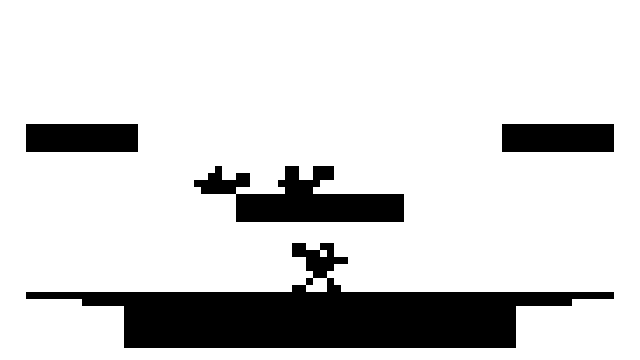](<metadata/screenshots/AERIAL-ASSAULT.png>) |
| Agaruino | ogbaba | GPLv3 | — | [Agaruino](https://github.com/ogbaba/Agaruino) | [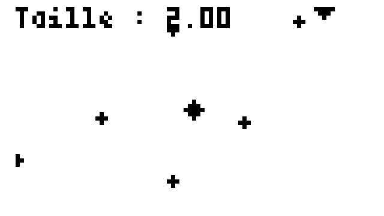](metadata/screenshots/AGARUINO.png) |
| Aimbuino | Baptiste Pouget (hosted under ogbaba's account) | GPLv3 | ✅ | [Aimbuino](https://github.com/ogbaba/Aimbuino) | [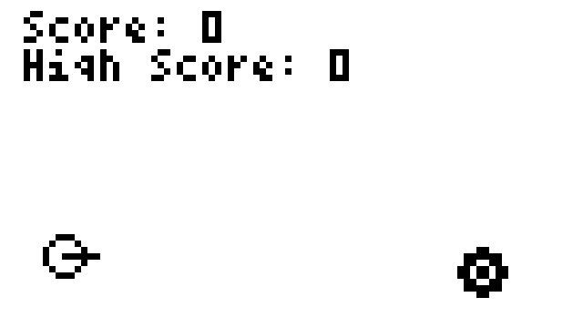](metadata/screenshots/AIMBUINO.png) |
| Another 2048 | grafMakulaDer2te | None | — | [another2048](https://github.com/grafMakulaDer2te/another2048) | [](<metadata/screenshots/ANOTHER%202048.png>) |
| Armageddon | wuuff | GPLv3 | ✅ | [armageddon](https://github.com/wuuff/armageddon) | [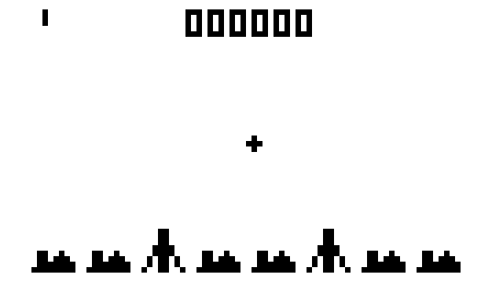](metadata/screenshots/ARMAGEDDON.png) |
| Artillery | Frakasss | None | — | [Artillery](https://github.com/Frakasss/Artillery) | [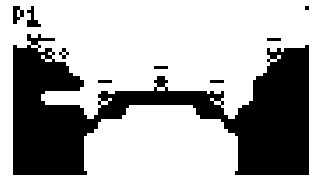](metadata/screenshots/ARTILLERY.png) |
| Asterocks | Yoda Zhang | None | ✅ | [yodasvideoarcade.com](https://yodasvideoarcade.com/gamebuino.php) | [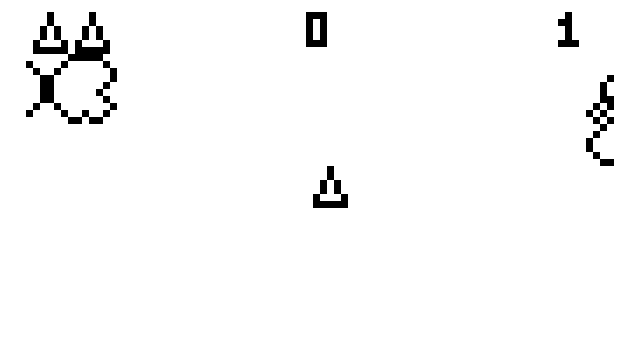](metadata/screenshots/ASTEROCKS.png) |
| AsteroidRipper | ripper121 | None | — | Recovered via direct download (no stable link) | [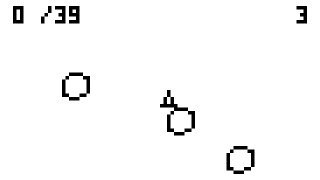](metadata/screenshots/ASTEROIDRIPPER.png) |
| B-Rally | scmar | MIT | ✅ | [B Rally](https://github.com/scmar/B-Rally) | [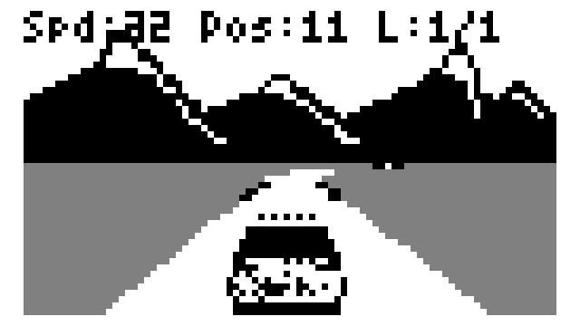](<metadata/screenshots/B-RALLY.png>) |
| Bang! Bang! | RackhamLeNoir | GPLv3 | — | [gamebuino bangbang](https://github.com/RackhamLeNoir/gamebuino-bangbang) | [](<metadata/screenshots/BANG!%20BANG!.png>) |
| BigBlackBox | STUDIOCRAFTapps | Custom (non-commercial, keep credit - see source) | ✅ | [akkera102 08 gamebuino](https://github.com/akkera102/08_gamebuino) | [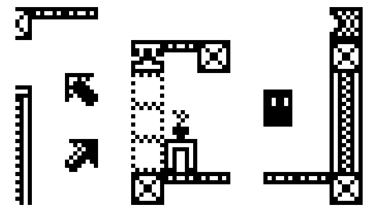](metadata/screenshots/BIGBLACKBOX.png) |
| Blob Attack | LudumDareDevelopment | None | ✅ | [Blob Attack](https://github.com/LudumDareDevelopment/Blob-Attack) | [](metadata/screenshots/BLOB%20ATTACK.png) |
| Blockdude | Sorunome | None | ✅ | [blockdude gamebuino](https://github.com/Sorunome/blockdude-gamebuino) | [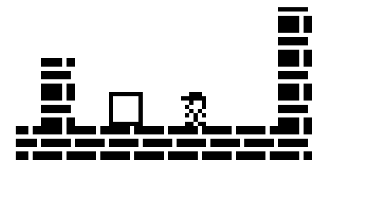](metadata/screenshots/BLOCKDUDE.png) |
| BlocksBuino | frthery | None | — | [BlocksBuino](https://github.com/frthery/BlocksBuino) | [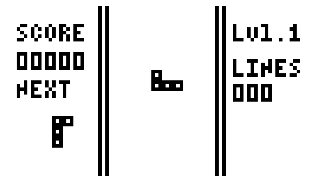](metadata/screenshots/BLOCKSBUINO.png) |
| Bomber | Clement83 | None | — | [Bomber](https://github.com/Clement83/Bomber) | [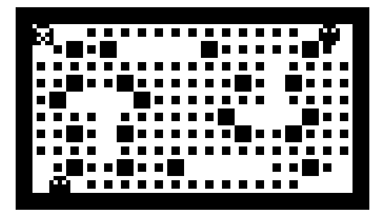](metadata/screenshots/BOMBER.png) |
| Breakout Ripper | ripper121 | None | — | Recovered via direct download (no stable link) | [](metadata/screenshots/BREAKOUT%20RIPPER.png) |
| Bub | smogheap | GPLv3 | ✅ | [smogheap.github.io/bub](https://smogheap.github.io/bub/) | [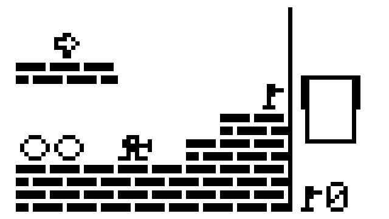](metadata/screenshots/BUB.png) |
| Castle Defence | kh9282 | None | ✅ | [CastleDefence](https://github.com/kh9282/CastleDefence) | [](metadata/screenshots/CASTLE%20DEFENCE.png) |
| Catcher | qubist | None | — | [Gamebuino Catcher](https://github.com/qubist/Gamebuino-Catcher) | [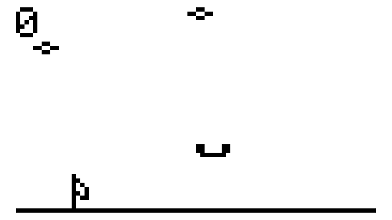](metadata/screenshots/CATCHER.png) |
| Community RPG | Sorunome | None | — | [gamebuino community rpg](https://github.com/Sorunome/gamebuino-community-rpg) | [](<metadata/screenshots/COMMUNITY%20RPG.png>) |
| Conduit | adekto | MIT | — | [conduit](https://github.com/adekto/conduit) | [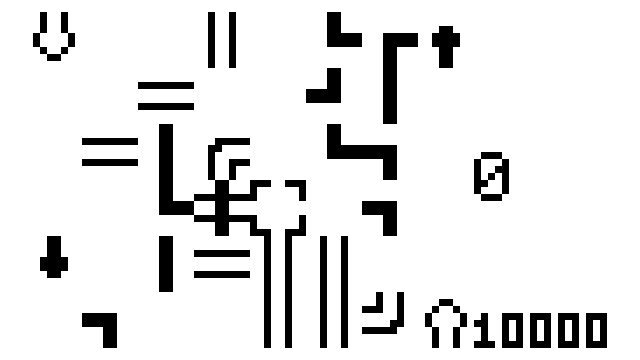](metadata/screenshots/CONDUIT.png) |
| Copter | Clement83 | None | — | [Copter](https://github.com/Clement83/Copter) | [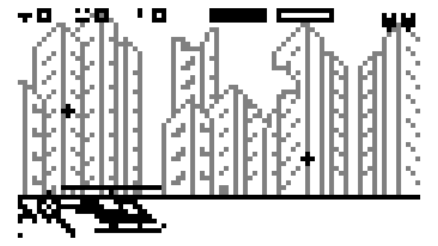](metadata/screenshots/COPTER.png) |
| CopterStrike | Frakasss | None | — | [CopterStrike](https://github.com/Frakasss/CopterStrike) | [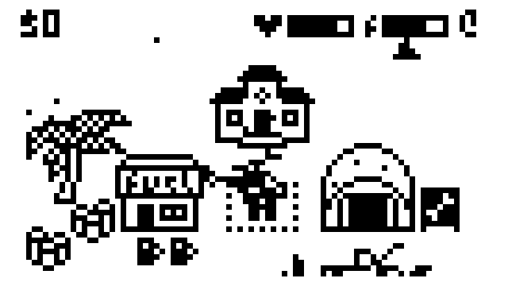](metadata/screenshots/COPTERSTRIKE.png) |
| Crabator | Rodot | None | ✅ | [Crabator](https://github.com/Rodot/Crabator) | [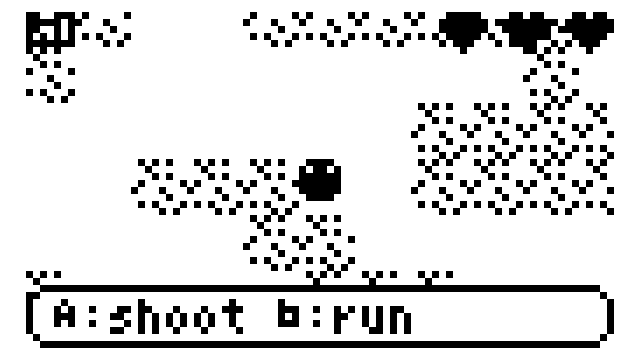](metadata/screenshots/CRABATOR.png) |
| CrazyCar | Baptiste Pouget | GPLv3 | — | [CRAZYCAR Gamebuino](https://github.com/baptistepouget/CRAZYCAR-Gamebuino) | [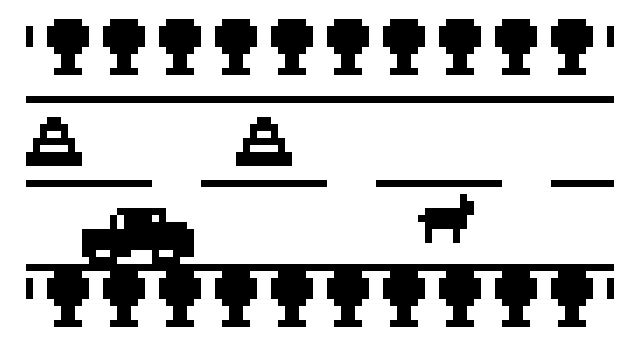](metadata/screenshots/CRAZYCAR.png) |
| CrazyTown | Clement Quintard | None | ✅ | [CrazyTown](https://github.com/Clement83/CrazyTown) | [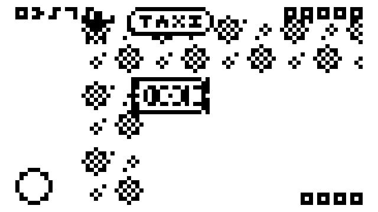](metadata/screenshots/CRAZYTOWN.png) |
| Cruiser | Michael Specht | None | — | [cruiser](https://github.com/specht/cruiser) | [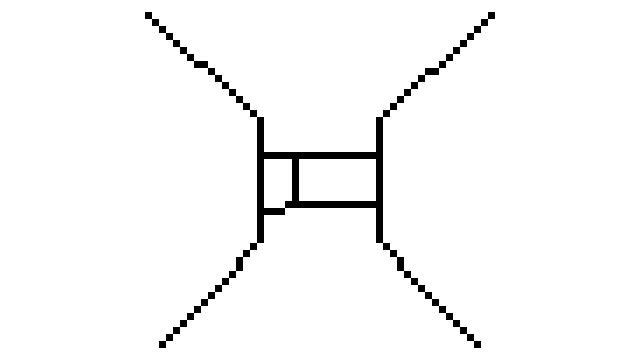](metadata/screenshots/CRUISER.png) |
| Dark Tower | Marcus Hutchings | GPLv3 | — | [DarkTower](https://github.com/marcushutchings/DarkTower) | [](<metadata/screenshots/DARK%20TOWER.png>) |
| DarkShmup | Clement83 | None | — | [DarkShmup](https://github.com/Clement83/DarkShmup) | [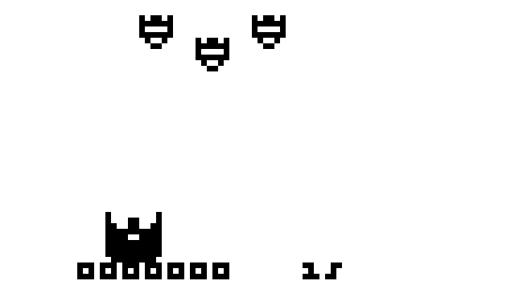](metadata/screenshots/DARKSHMUP.png) |
| DeathMaze | msevilgenius | None | ✅ | Recovered via direct download (no stable link) | [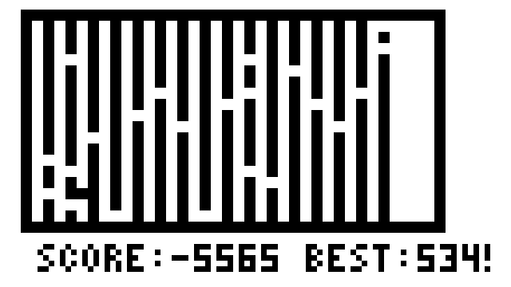](metadata/screenshots/DEATHMAZE.png) |
| Descent into Hell | etienne72230 | None | ✅ | [DescentIntoHeel](https://github.com/etienne72230/DescentIntoHeel) | [](metadata/screenshots/DESCENT%20INTO%20HELL.png) |
| Digger | scmar | None | ✅ | [Digger](https://github.com/scmar/Digger) | [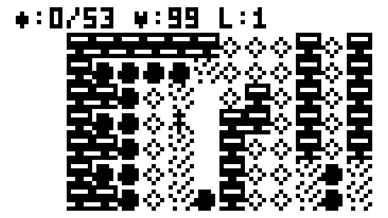](metadata/screenshots/DIGGER.png) |
| Elventure | trodoss (original, TEAM a.r.g.) / wuuff (Gamebuino port) | GPLv3 | — | [Elventure](https://github.com/wuuff/Elventure) | [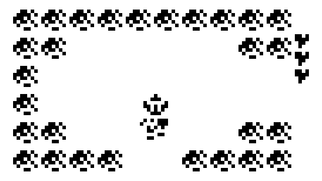](metadata/screenshots/ELVENTURE.png) |
| Fifteen | Tnxec2 | None | ✅ | [fifteen](https://github.com/Tnxec2/fifteen) | [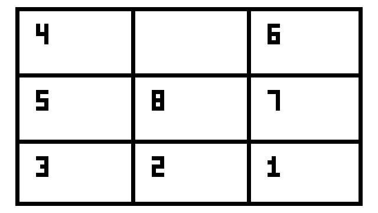](metadata/screenshots/FIFTEEN.png) |
| FireBuino! | LADBSoft | LGPLv3 | ✅ | [makerbuino firebuino](https://github.com/ladbsoft/makerbuino-firebuino) | [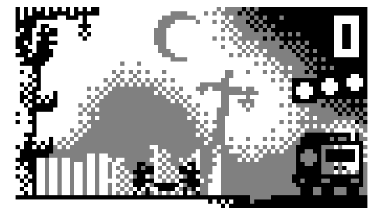](metadata/screenshots/FIREBUINO.png) |
| Firemen | Vicking69 | GPLv2 | ✅ | [firemen](https://github.com/Vicking69/firemen) | [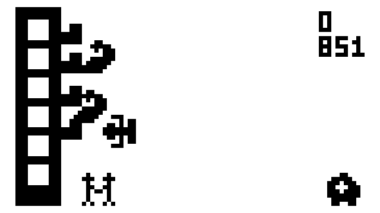](metadata/screenshots/FIREMEN.png) |
| Flappy Birdo | Forklift5 | None | ✅ | [FlappyBirdo](https://github.com/Forklift5/FlappyBirdo) | [](metadata/screenshots/FLAPPY%20BIRDO.png) |
| Footlol | Baptiste Pouget (hosted under ogbaba's account) | GPLv3 | — | [FOOTLOL Gamebuino](https://github.com/ogbaba/FOOTLOL-Gamebuino) | [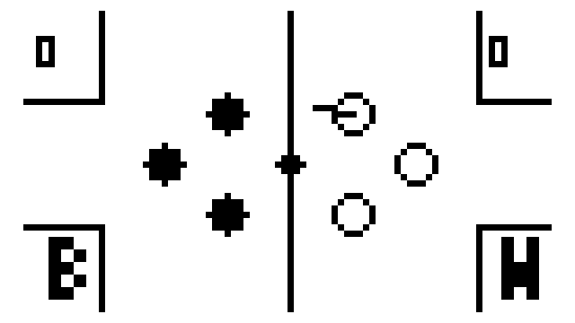](metadata/screenshots/FOOTLOL.png) |
| Gamebuino2048 | Josiah Winslow | None | ✅ | Mediafire (no stable link) | [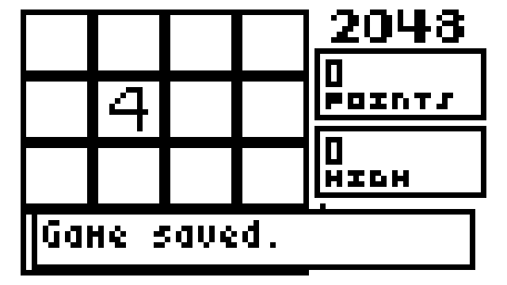](metadata/screenshots/2048.png) |
| Gemgem | Tnxec2 | None | ✅ | [gemgem gamebuino](https://github.com/Tnxec2/gemgem-gamebuino) | [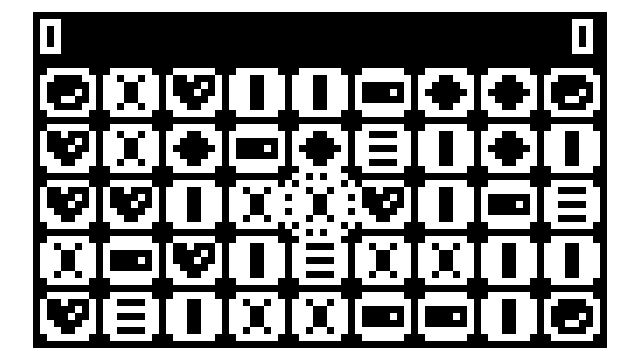](metadata/screenshots/GEMGEM.png) |
| GlaciGlaca | Clement83 | None | — | [GlaciGlaca](https://github.com/Clement83/GlaciGlaca) | [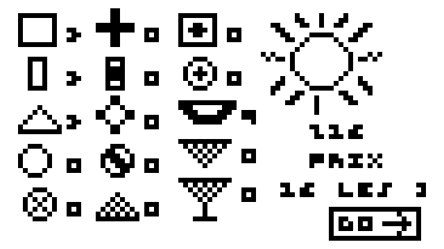](metadata/screenshots/GLACIGLACA.png) |
| Gruniozerca | Arkadiusz Kaminski (arhneu) | Unlicense | ✅ | [gruniozerca gamebuino](https://github.com/arhneu/gruniozerca-gamebuino) | [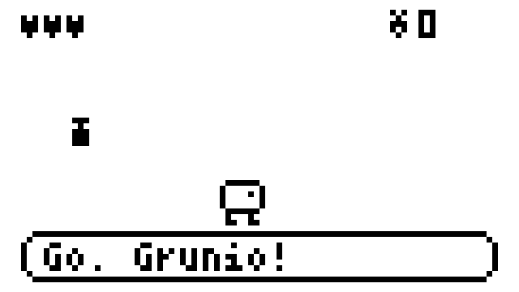](metadata/screenshots/GRUNIOZERCA.png) |
| Invaders | Yoda Zhang | None | ✅ | [yodasvideoarcade.com](https://yodasvideoarcade.com/gamebuino.php) | [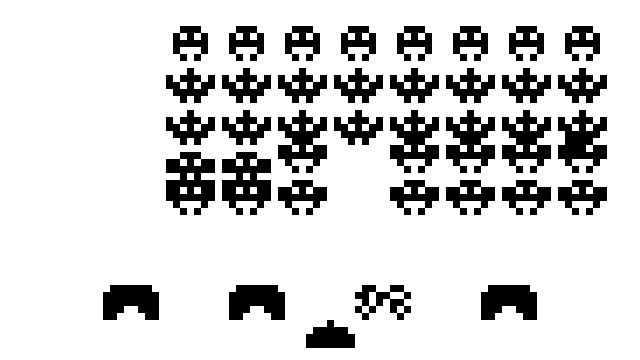](metadata/screenshots/INVADERS.png) |
| Jezzball | RackhamLeNoir | GPLv3 | ✅ | [gamebuino jezzball](https://github.com/RackhamLeNoir/gamebuino-jezzball) | [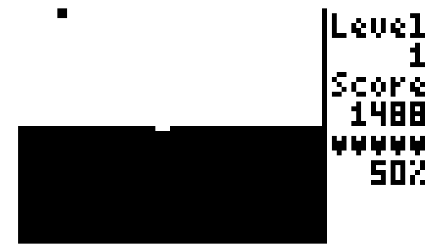](metadata/screenshots/JEZZBALL.png) |
| Kill Race | Yoda Zhang | None | ✅ | [yodasvideoarcade.com](https://yodasvideoarcade.com/gamebuino.php) | [](metadata/screenshots/KILL%20RACE.png) |
| Lander | Yoda Zhang | None | ✅ | [yodasvideoarcade.com](https://yodasvideoarcade.com/gamebuino.php) | [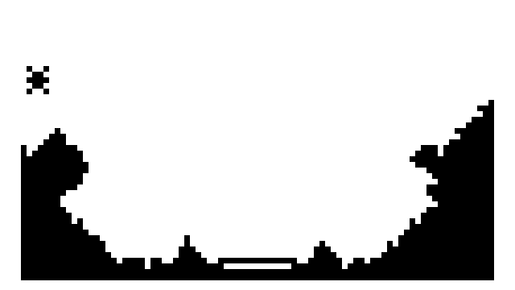](metadata/screenshots/LANDER.png) |
| Lights Out AD | 94k | WTFPL | — | Recovered via direct download (no stable link) | [](<metadata/screenshots/LIGHTS%20OUT%20AD.png>) |
| Maruino | ajsb113 | None | — | Dropbox (no stable link) | [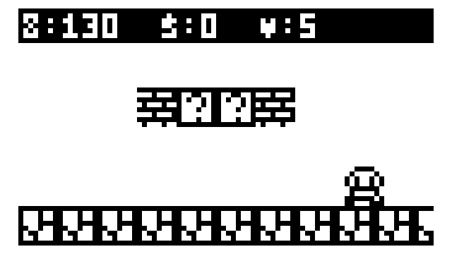](metadata/screenshots/MARUINO.png) |
| Master Kebab | ogbaba | GPLv3 | ✅ | [RMKebab](https://github.com/ogbaba/RMKebab) | [](<metadata/screenshots/MASTER%20KEBAB.png>) |
| Maze | Andy O'Neill | MIT | — | [gamebuino maze](https://github.com/aoneill01/gamebuino-maze) | [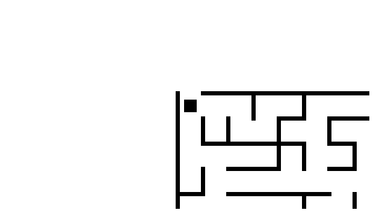](metadata/screenshots/MAZE.png) |
| microHexagon | valdenthoranar | None | ✅ | [microhexagon](https://bitbucket.org/valdenthoranar/microhexagon) | [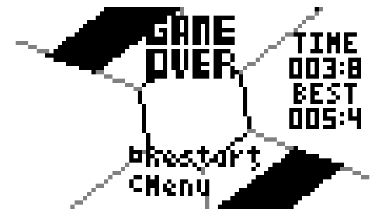](metadata/screenshots/MICROHEXAGON.png) |
| Minesweeper | dirksteindorf | None | — | [Gamebuino Minesweeper](https://github.com/dirksteindorf/Gamebuino-Minesweeper) | [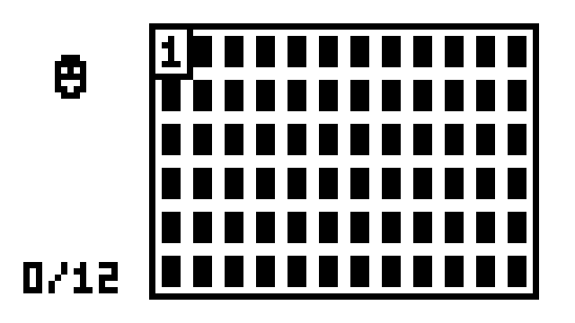](metadata/screenshots/MINESWEEPER.png) |
| Mole Control | grafMakulaDer2te | None | — | [mole control](https://github.com/grafMakulaDer2te/mole-control) | [](<metadata/screenshots/MOLE%20CONTROL.png>) |
| MotoCross | Clement83 | None | — | [MotoCross](https://github.com/Clement83/motoCross) | [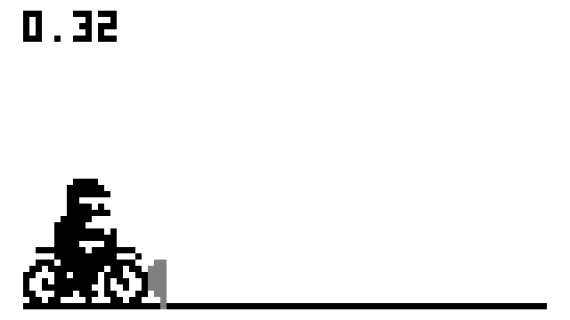](metadata/screenshots/MOTOCROSS.png) |
| MyRPG | Frakasss | None | — | [MyRPG](https://github.com/Frakasss/MyRPG) | [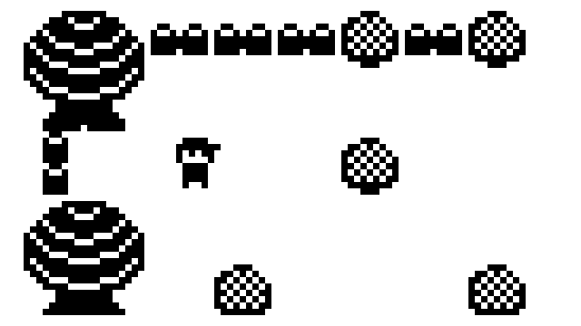](metadata/screenshots/MYRPG.png) |
| No Name Platform Game | Frakasss | None | — | [NoNamePlatformGame](https://github.com/Frakasss/NoNamePlatformGame) | [](<metadata/screenshots/NO%20NAME%20PLATFORM%20GAME.png>) |
| Paqman | Yoda Zhang | None | ✅ | [yodasvideoarcade.com](https://yodasvideoarcade.com/gamebuino.php) | [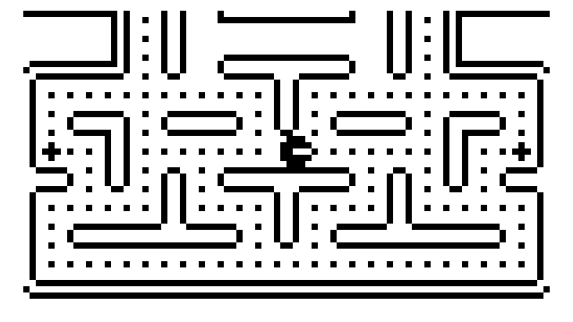](metadata/screenshots/PAQMAN.png) |
| Parachute | Jicehel | None | — | [Parachute Gamebuino](https://github.com/jicehel/Parachute_Gamebuino) | [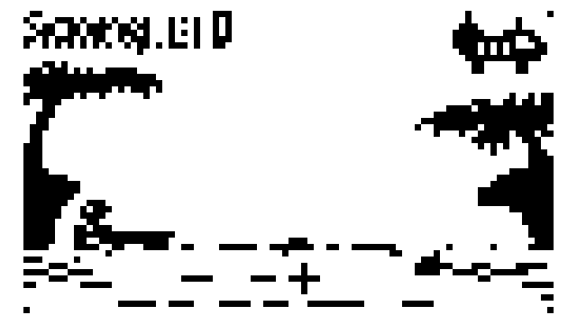](metadata/screenshots/PARACHUTE.png) |
| PetitMonstre | Clement83 | None | — | [PetitMonstre](https://github.com/Clement83/petitMonstre) | [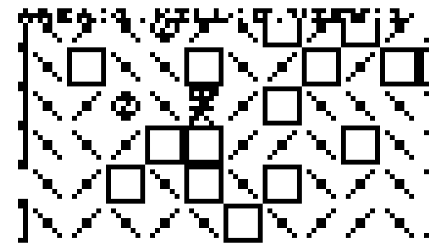](metadata/screenshots/PETITMONSTRE.png) |
| PinBall | Clement83 | None | — | [pinBall](https://github.com/Clement83/pinBall) | [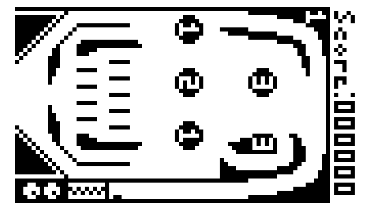](metadata/screenshots/PINBALL.png) |
| Pong 2017 | yawn-g | None | — | [pong 2017](https://github.com/yawn-g/pong-2017) | [](<metadata/screenshots/PONG%202017.png>) |
| Pong Local Multiplayer | qubist | None | — | [Gamebuino PongLocalMultiplayer](https://github.com/qubist/Gamebuino-PongLocalMultiplayer) | [](<metadata/screenshots/PONG%20LOCAL%20MULTIPLAYER.png>) |
| Pong Solo | Aurelien Rodot | LGPLv3 | — | [Gamebuino Classic examples](https://github.com/Gamebuino/Gamebuino-Classic/tree/master/examples/2.Intermediate/Pong) | [](metadata/screenshots/PONG%20SOLO.png) |
| Punkt | Andy O'Neill | MIT | ✅ | [gamebuino punkt](https://github.com/aoneill01/gamebuino-punkt) | [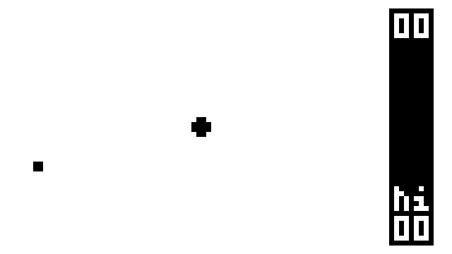](metadata/screenshots/PUNKT.png) |
| Ralph | Clement83 | None | — | [Ralph](https://github.com/Clement83/ralph) | [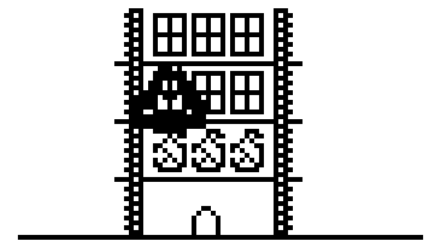](metadata/screenshots/RALPH.png) |
| Robot | Frakasss | None | — | [Robot](https://github.com/Frakasss/Robot) | [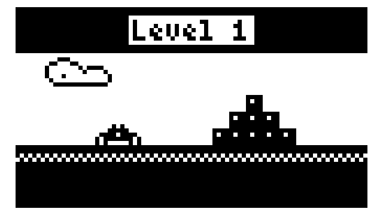](metadata/screenshots/ROBOT.png) |
| Save Princesse | Clement83 | None | — | [SavePrincesse](https://github.com/Clement83/SavePrincesse) | [](<metadata/screenshots/SAVE%20PRINCESSE.png>) |
| Senet | Maximilian Timmerkamp | Apache 2.0 | — | Recovered via direct download (originally hosted on Bitbucket, no stable link) | [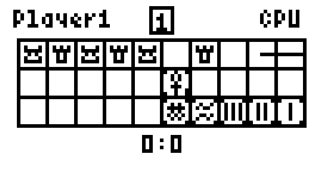](metadata/screenshots/SENET.png) |
| shipwrek | yawn-g | None | — | [shipwrek](https://github.com/yawn-g/shipwrek) | [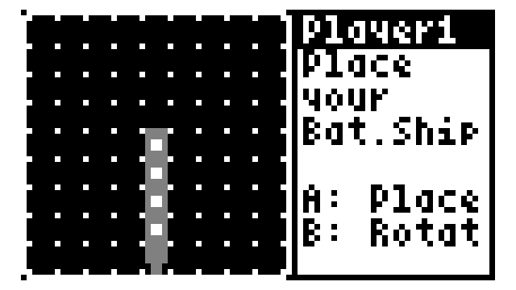](metadata/screenshots/SHIPWREK.png) |
| ShootBuino | frthery | None | ✅ | [ShootBuino](https://github.com/frthery/ShootBuino) | [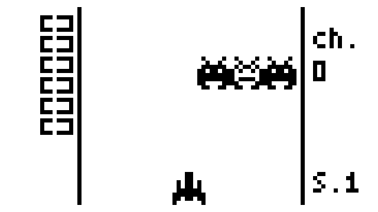](metadata/screenshots/SHOOTBUINO.png) |
| Shufflepuck Cafe | AWOT83 | GPLv3 | — | [Gamebuino Shufflepuck cafe](https://github.com/Awot83/Gamebuino-Shufflepuck_cafe) | [](metadata/screenshots/SHUFFLEPUCK%20CAFE.png) |
| Simonbuino | Jerom (Forklift5) | None | — | [Simonbuino](https://github.com/Forklift5/Simonbuino) | [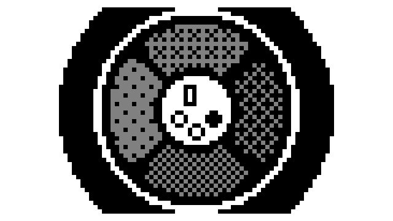](metadata/screenshots/SIMONBUINO.png) |
| Skibuino | Mike Del Pozzo | GPLv3 | ✅ | [skibuino](https://github.com/delpozzo/skibuino) | [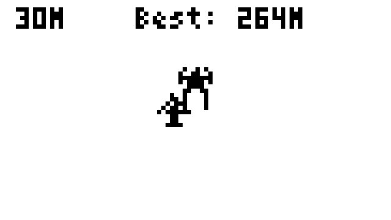](metadata/screenshots/SKIBUINO.png) |
| Smash-and-Crash | Skyrunner65 | None | — | [Smash and Crash](https://github.com/Skyrunner65/Smash-and-Crash) | [](metadata/screenshots/SMASH%20AND%20CRASH.png) |
| Snake 5110 | Lady Awesome & MakerSquirrel | CC-BY-SA 2018 / GPLv3 (unresolved conflict, see source) | ✅ | [Gamebuino Classic Snake 5110](https://github.com/makerSquirrel/Gamebuino-Classic-Snake-5110) | [](<metadata/screenshots/SNAKE%205110.png>) |
| Snake ABC | frthery | None | — | [SnakeAbcBuino](https://github.com/frthery/SnakeAbcBuino) | [](metadata/screenshots/SNAKE%20ABC.png) |
| Snake Classic | Ripper121 (original), Tnxec2 (fork) | None | — | [snake gamebuino classic](https://github.com/Tnxec2/snake-gamebuino-classic) | [](metadata/screenshots/SNAKE%20CLASSIC.png) |
| Sokobuino | martinsustek | None | ✅ | Recovered via direct download (no stable link) | [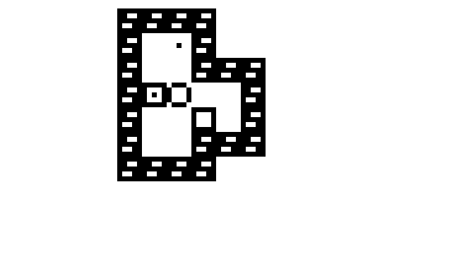](metadata/screenshots/SOKOBUINO.png) |
| Solitaire | Andy O'Neill | MIT | ✅ | [gamebuino solitaire](https://github.com/aoneill01/gamebuino-solitaire) | [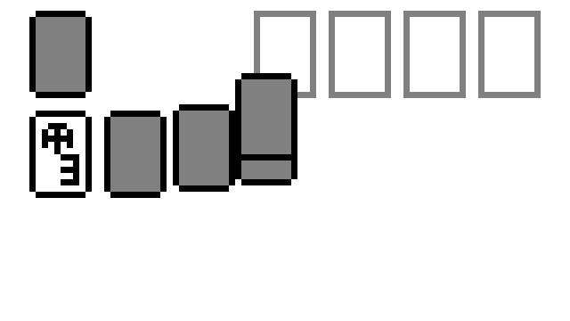](metadata/screenshots/SOLITAIRE.png) |
| Sound Test | willems davy | GPLv3 (this project's own code) | — | Not a ported game - a sound-shim diagnostic tool, see above | [](<metadata/screenshots/SOUND%20TEST.png>) |
| Spin Spin Spinbuino! | Charly Piva "Zoglu" / Margot Piva "Isil" | None | ✅ | zoglu.net (no stable link) | [](<metadata/screenshots/SPIN%20SPIN%20SPINBUINO!.png>) |
| Star Honor | Wenceslao Villanueva Jr (original) / wuuff (Gamebuino port) | MIT | — | [StarHonor](https://github.com/wuuff/StarHonor) | [](<metadata/screenshots/STAR%20HONOR.png>) |
| StickFighter | Clement83 (art by Quirby64) | None | — | [StickFighter](https://github.com/Clement83/StickFighter) | [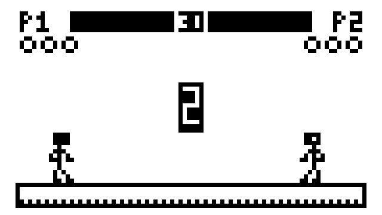](metadata/screenshots/STICKFIGHTER.png) |
| Stijn's Pong | Stijn Caerts | MIT | — | [Gamebuino (StijnCaerts)](https://github.com/StijnCaerts/Gamebuino) | [](<metadata/screenshots/STIJN'S%20PONG.png>) |
| Stijn's Snake | Stijn Caerts | MIT | — | [Gamebuino (StijnCaerts)](https://github.com/StijnCaerts/Gamebuino) | [](<metadata/screenshots/STIJN'S%20SNAKE.png>) |
| Super Crate Buino | Aurelien Rodot | None | ✅ | [Super Crate Buino](https://github.com/Rodot/Super-Crate-Buino) | [](<metadata/screenshots/SUPER%20CRATE%20BUINO.png>) |
| Super Space Shooter | msevilgenius | None | — | [Gamebuino SuperSpaceShooter](https://github.com/msevilgenius/Gamebuino-SuperSpaceShooter) | [](<metadata/screenshots/SUPER%20SPACE%20SHOOTER.png>) |
| T-Rex Quest | Awot83 | GPLv3 | — | [Gamebuino TREX QUEST](https://github.com/Awot83/Gamebuino-TREX-QUEST) | [](<metadata/screenshots/T-REX%20QUEST.png>) |
| Taquin | RackhamLeNoir | GPLv3 | — | [gamebuino taquin](https://github.com/RackhamLeNoir/gamebuino-taquin) | [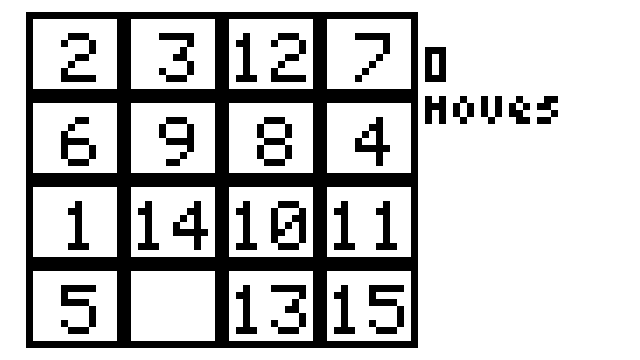](metadata/screenshots/TAQUIN.png) |
| Tetrino | j0ff | MIT | — | [tetrino](https://github.com/j0ff/tetrino) | [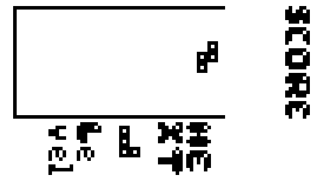](metadata/screenshots/TETRINO.png) |
| Thunder Shoot | Awot83 | GPLv3 | — | [Gamebuino Thunder Shoot](https://github.com/Awot83/Gamebuino-Thunder-Shoot) | [](<metadata/screenshots/THUNDER%20SHOOT.png>) |
| Tron | Clement83 | None | — | [Tron](https://github.com/Clement83/Tron) | [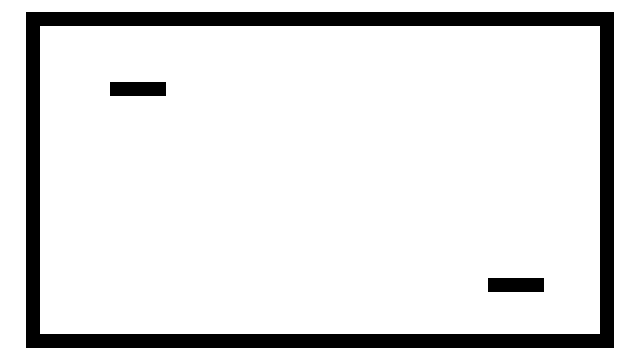](metadata/screenshots/TRON.png) |
| UFO Race | Rodot | None | ✅ | [UFO Race](https://github.com/Rodot/UFO-Race) | [](metadata/screenshots/UFO%20RACE.png) |
| Under the Tower | wuuff | GPLv3 | ✅ | [under the tower](https://github.com/wuuff/under-the-tower) | [](<metadata/screenshots/UNDER%20THE%20TOWER.png>) |
| Video Poker | Mike Del Pozzo | GPLv3 | ✅ | [videopoker gamebuino](https://github.com/delpozzo/videopoker-gamebuino) | [](metadata/screenshots/VIDEO%20POKER.png) |
| World's Hardest Game | Sorunome | None | ✅ | [Worlds Hardest Game Gamebuino](https://github.com/Sorunome/Worlds-Hardest-Game-Gamebuino) | [](<metadata/screenshots/WORLD'S%20HARDEST%20GAME.png>) |
| Xonix | Tnxec2 | None | — | [xonix gamebuino](https://github.com/Tnxec2/xonix-gamebuino) | [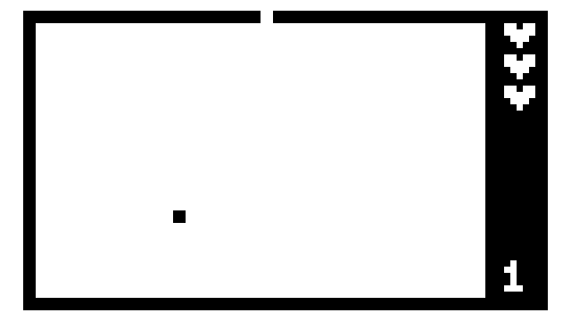](metadata/screenshots/XONIX.png) |
| ZombiEscape | Frakasss | None | — | [ZombiEscape](https://github.com/Frakasss/ZombiEscape) | [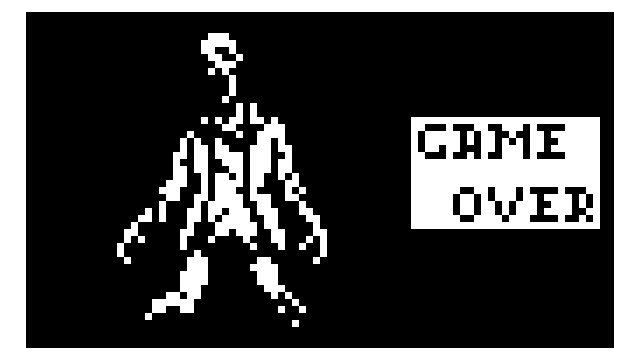](metadata/screenshots/ZOMBIESCAPE.png) |

## Credits

- [gamebuino_classic_vircon32](https://github.com/joyrider3774/gamebuino_classic_vircon32) -
  the original Vircon32 port this project is itself ported from: every
  game's own C logic (`src/gameworld/games/`), already ported once from
  the original Gamebuino Classic sources and already bug-fixed through its
  own extensive play-testing history, was carried over here essentially
  unchanged - only a mechanical dialect conversion (see `CLAUDE.md`)
  touched it to make it build as standard C instead of Vircon32's own
  restricted dialect. This project's own platform layer (SDL3/SDL2/
  Playdate) is new; the game code underneath it is not.
- [Gamebuino Classic library](https://github.com/Gamebuino/Gamebuino-Classic)
  (Aurélien Rodot, LGPLv3) - this project's own `src/gameworld/
  gamebuinoShim.h`/`.c` reproduces its real API (buttons, display, sound)
  on top of SDL/Playdate, and its own real `font5x7`/`font3x5`/`font3x3`
  bitmap fonts are ported verbatim for in-game text rendering.
- [Vircon32](https://www.vircon32.com/) - the fantasy console the game
  logic here was originally ported through. This project's own menu/
  dialog text (SDL2/SDL3 only - Playdate uses its own native system font)
  is drawn with a faithful reproduction of Vircon32's real BIOS font
  (`src/gameworld/biosFont.h` - 10x20px, codepage 1252, all 256 glyphs
  extracted directly from the actual BIOS font asset, not hand-
  transcribed), authored by **Carra** (Vircon32's own author) and
  published on OpenGameArt.org as *"Pixel Art Outlined Text Fonts"* under
  **CC-BY 4.0** - a separate license from this project's own GPLv3 below;
  this credit is that license's own attribution requirement.
- [Tinyjoypad_SDL](https://github.com/joyrider3774/Tinyjoypad_SDL) (same
  author, a different game collection) - the direct architectural
  template this whole multi-port repo is modeled on (the `src/<port>/`
  directory layout, per-port `CMakeLists.txt` shape, CLI flag set), and
  the source of the `CInput` keyboard/gamepad abstraction and the audio
  oscillator shape, both copied verbatim - see `CLAUDE.md` for exactly
  where each was reused versus built fresh for this project's own
  Gamebuino-specific needs.
- Every individual game's own original author/license is preserved
  unmodified in its own header comment under `src/gameworld/games/` and
  listed per-game in the "Games" table above.

## License

This project is **GPLv3** (`LICENSE.txt`): several of the games shipped
here (Agaruino, CrazyCar, Shufflepuck Cafe, Taquin, and others) are
themselves GPLv3, and combining GPLv3 code into one executable makes the
whole executable a GPLv3 combined work. This covers this project's own new
code (the SDL3/SDL2/Playdate platform layers, the shared menu) - each
individual game's own original license/attribution is preserved unmodified
in its own header comment in `src/gameworld/games/`.

**Known concern**: Firemen's own upstream `LICENSE.md` says only "GPL V2",
with no "or later version" clause found - GPLv2-only code is not
license-compatible with GPLv3 the way every other GPL'd game here (all
GPLv3) is, so combining it into this same GPLv3 binary as-is is a real,
unresolved licensing conflict, not just a compatible-license bookkeeping
detail. Inherited directly from the source Vircon32 project, flagged here
rather than silently ignored; not yet resolved.

## See also

- [CLAUDE.md](CLAUDE.md) - this project's own architecture, the multi-port
  structure, the dialect-conversion process, every bug found during this
  specific SDL/Playdate port, and the Playdate port's own full design
  writeup.
- [gamebuino_classic_vircon32/BUGS.md](https://github.com/joyrider3774/gamebuino_classic_vircon32/blob/main/BUGS.md) -
  the full list of real upstream gameplay bugs deliberately preserved vs.
  fixed, inherited along with the ported C code itself.
- [gamebuino_classic_vircon32/CLAUDE.md](https://github.com/joyrider3774/gamebuino_classic_vircon32/blob/main/CLAUDE.md) -
  the full per-game porting history (every game-logic bug found and fixed,
  the AVR-vs-Vircon32 dialect bug family) that this project inherited
  along with the ported C code itself.
